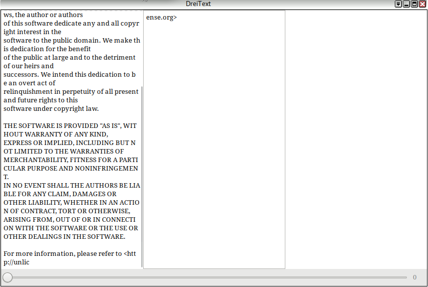

# DreiText

DreiText is a small gtk+ 3 (gtkmm) textfile Reader(!!) - it splits the text into 3 columns to make it better readable. I try a golang version, too. But golang-ui sucks.

## IT IS JUST A PROOF OF WORK

Yes. You can build a xml-gui and combine it with c++ code is not bad.

## To DO's

  - preferences
      - font family
      - font size
      - colors (foreground/back)
      - linenumbers (on/off)
      - unvisible chars (on/off)
      - blocksize
      - use 4 columns (on/off)
  - next/prev page buttons
  - blocksize bar
  - save button
  - faster via file pointer
  - cli option: HEX mode

## Not to dos

  - it is primary cli opening
  - it is primary for reading Text files easy
  - save/editor function is not the primary aim
  - cli is not for setting gui preferences

